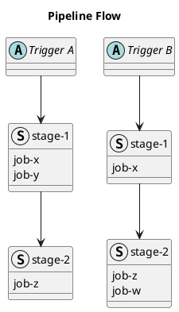
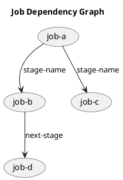
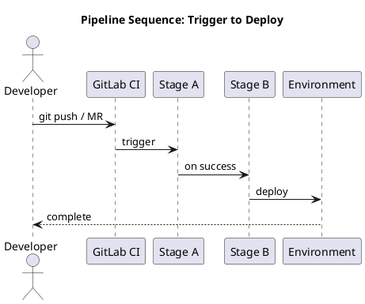

# Pipeline PlantUML Skill

Generates PlantUML pipeline diagrams, saves source files, renders via the public server, and returns Markdown-embeddable image syntax.

## Workflow

### 1. Write the .puml source

Save to `<output_dir>/diagrams/<diagram_name>.puml`. Always wrap in `@startuml` / `@enduml` and include a `title`.

### 2. Render via PlantUML public server

Run this Python snippet via Bash to encode and get the URL:

```python
import zlib, base64, string

def plantuml_encode(text):
    compressed = zlib.compress(text.encode('utf-8'))[2:-4]
    std = base64.b64encode(compressed).decode('ascii')
    table = string.ascii_uppercase + string.ascii_lowercase + string.digits + '+/'
    puml  = '0123456789ABCDEFGHIJKLMNOPQRSTUVWXYZabcdefghijklmnopqrstuvwxyz-_'
    return ''.join(puml[table.index(c)] if c in table else c for c in std)

with open('<path_to_puml_file>') as f:
    content = f.read()
print(f"https://www.plantuml.com/plantuml/png/{plantuml_encode(content)}")
```

### 3. Embed in Markdown

```markdown

```

---

## Diagram patterns

### Pipeline flow (trigger-based)

Use `struct` blocks for stage groupings and `abstract` nodes for each trigger. Add `top to bottom direction` so chains render side by side. Always use `as alias` on structs — never use hyphenated names directly in arrows. Use `--` inside structs to divide job groups.

Infer which jobs and stages appear per trigger from the pipeline's `rules:` — do not assume a fixed set of triggers.



### Job dependency graph

Use `(job)` nodes with `-->` arrows from `needs:` relationships. Label arrows with the stage name.



### Sequence diagram (trigger → deploy)

Show the actor, then each stage as a participant in execution order.



---

## Quality rules

- Give every diagram a descriptive `title`
- Match node labels exactly to job/stage names from the source
- Use `-->` (dashed) for conditional flows, `->` (solid) for always-runs
- No `> 📎 Source:` captions in Markdown — just the image
